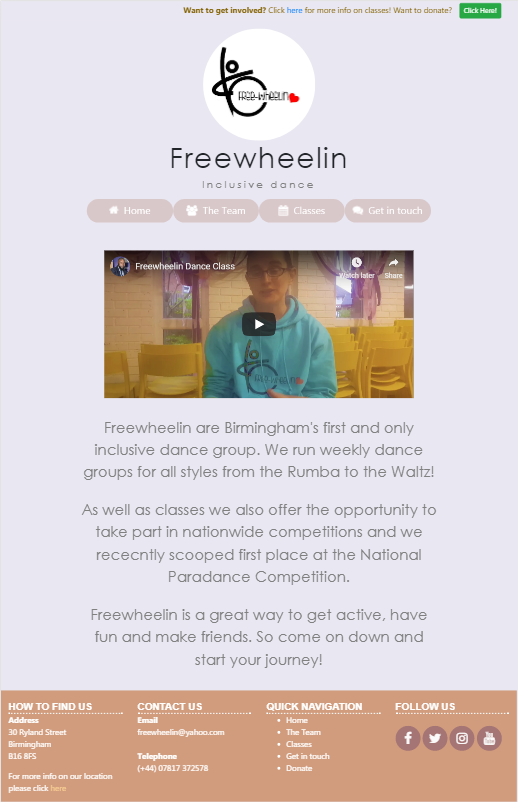

# Freewheelin website

## Stream 1 Mileston Project - User Centric Frontend Development - Code Institute

This is a website for a local inclusive dance company. The website provides information regarding all aspects of Freewheelin from staff and class times to contact details and donations, thus 
making it a useful tool to demonstate the many tools and skills I have picked up so far on the course.

## Demo

A live demo of the website can be found [here](https://francisillingworth.github.io/milestone-project-1/index.html)\

## UX

The goal of my design was to create a welcoming website with the primary goal of attracting new members to the dance company. It should be a place where
prospective newcomers dont feel intimidated, be that by information overload, harsh visual design and blunt language.\
To do this I have created a minimalist design where each page contains small amounts of the most important information.
The idea behind this was to not overload the visitor and put them at a sense of ease.
This thought process translated into all aspects of the page. Elements are all rounded not just to feel
fun but also to be neutral and welcoming as opposed to harsh boxes with sharp corners (you will notice only the youtube clip on index.html has real square corners- 
these were kept because of peoples familiarity with the format of youtube videos).
I chose a pastel color palate to create something both bright but also welcoming, I also feel it fits in with modern styles in web development where softer colours
are favoured over harsher brighter colours.
\
The website is designed as mobile first. You will notice that there are multiple changes when moving from desktop to mobile device sizes. For example, the page title 
(Freewheelin-Inclusive dance) and nav bar disappears as you move to below the destop size. This is because whilst on a desktop it allows for smooth movement between pages where only the content appears
to change, on tablet and mobile devices they take up too much real estate on the screen. Couple this with the fact that below desktop size the nav bar is condensed into a burger icon, then
smoothness of transition between pages is less of a priority here. Another example of this is that I decided to include a map in the footer for mobile devices only whilst inserting a link to the map 
on classes.html in the footer for all larger devices. The reason here being that a map on a mobile device may be useful for someone actually in the vacinity trying to find the location so by putting it in the 
footer of mobile devices they will not have to navigate the website to find it. Whereas on larger devices where it is unlikely someone will be walking around with it open (i.e laptop), the map takes up too
much real estate on the footer making it look ugly This is why for devices larger than phones there is simply a link to the map in classes.html making the footer apper much more
concise and neat.

\
Bringing all these points together this website aims to be as friendly and welcoming as possible. The main barrier to gaining new members to the dance comapny is the fear 
people have of coming down for the first time as they dont know people, what to expect etc. By putting people at ease on the website I hope to create a friendly
vibe around Freewheelin immediately so there is less trepidation about making the leap and coming down to a class for the first time.

## Technologies

1)HTML5  
2)CSS3  
3)Bootstrap v.4.3.1  

## Features

The site features:
1) The bootstrap grid system layout.
2) A burger icon nav link that is responsive with the page nav bar so neither ever appear at the same time.
3) 2x bootstrap modals. One for registering to be contacted about a donation, One for sending an email with questions about classes.
4) Embedded responsive maps and videos.
5) Resonsive icon links that are hover sensitive using font awesome icons and hover.css from Github.

### Features left to implement

There are a few features that I would like to implement further down the line. 
1) A picture carousel on index.html and a gallery page containing photos and videos of performances.
2) An online payment platform (e.g paypal) on the donation link as opposed to registering and getting someone to contact you about a donation.
3) I'd like to add a page about future and past performances as well as news.

## Testing

The website has been tested extensively on android phones and tablets as well as iOS devices (iphone and ipad) with a font change to sans-serif required to run on iOS.
The website also runs smoothly on multiple browsers (chrome, firefox and safari).

All links to external sites open on new tabs to avoid visitor being navigated away from the website. All intenal links open within the same tab.

There are required fields in both the donate and contact us forms that will stop the form being submitted without being completed with an accompanying error message with the fault stated. The email sections also require an email address (@)to
be entered before allowing form submission.

## Deployment

The website is hosted by GitHub Pages and is deployed from the master branch. You can git clone the code to run it locally on your machine.

You can also git clone the code to run it locally on your machine via this [Milestone Project 1 Git Hub Link](https://github.com/francisillingworth/milestone-project-1)

## Credits

### Content

All content was written by myself with the exception of the biographies of the team members on team.html, these were provided by Helen Mason of Freewheelin.

### Media

All photos, images and videos were supplied by Freewheelin.

Maps were taken from google maps.

## Acknowledgements

Credit to tkjaergaard  https://gist.github.com/tkjaergaard/1853190  for inspiration on making the map circular and for ideas for code make it happen.

Please note - When migrating this project to AWS Cloud 9 for editing before resubmission all prior commits have been lost. These original commits can be seen in original project submission.

<strong>This is for educational use </strong>

